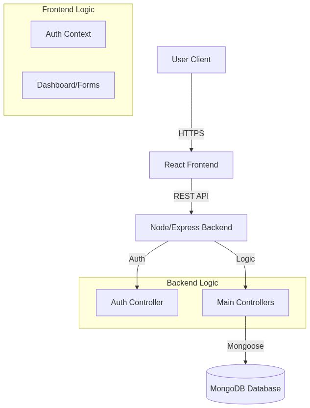
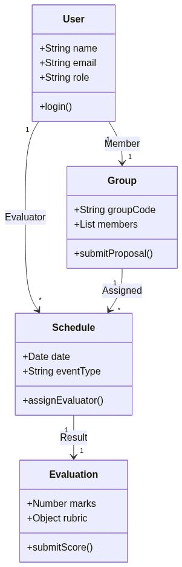
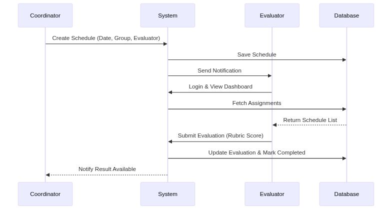

# Software Design Specification (SDS)
**Project:** FYP Management System  
**Version:** 1.0  
**Date:** December 09, 2025

---

## 1. Introduction
### 1.1 Purpose
This document describes the software architecture and design of the **FYP Management System**. It provides a high-level overview of the system topology, detailed component design, data structures, and the communication protocols used to meet the functional requirements.

### 1.2 Scope
The system facilitates the management of Final Year Projects for universities, handling group formation, proposal workflows, progress monitoring, and defense scheduling/evaluation.

---

## 2. System Architecture
### 2.1 Architectural Pattern
The system employs a **Layered Architecture** using the **MERN Stack**:
*   **Presentation Layer (Client):** React.js based Single Page Application (SPA).
*   **Application Layer (Server):** Node.js and Express.js REST API.
*   **Data Layer (Storage):** MongoDB NoSQL database.

### 2.2 Component Diagram

The system is divided into two main execution environments:
1.  **Client-Side**: Executes in the user's browser. Handles UI rendering and user input.
2.  **Server-Side**: Executes on a Node.js runtime. Handles business logic, authentication, and database connectivity.

---

## 3. Detailed Component Design

### 3.1 Frontend Subsystem
*   **Technology**: React 18, Vite, Tailwind CSS.
*   **Key Components**:
    *   `AuthContext`: Manages global user state and JWT storage.
    *   `Dashboard`: The layout controller that dynamically renders views based on Roles (Student vs. Coordinator).
    *   `Schedules`: Manages the calendar and defense events.
    *   `EvaluationForm`: A complex form with rubric sliders and score calculation logic.

### 3.2 Backend Subsystem
*   **Technology**: Node.js, Express.
*   **Design Pattern**: Model-View-Controller (MVC).
*   **Modules**:
    *   **Controllers**: Contain the business logic (e.g., `calculateGrade`, `assignEvaluator`).
    *   **Middleware**: Intercepts requests for security (e.g., `protect` checks for valid JWT, `authorize` checks for specific roles).
    *   **Routes**: Maps HTTP verbs (GET, POST) to controller functions.

---

## 4. Data Design
### 4.1 Database Schema (Class Diagram)

The database utilizes **MongoDB** schemas defined via **Mongoose**:
*   **User**: Stores authentication data, role, and department.
*   **Group**: Links students together; contains proposal status and supervisor reference.
*   **Schedule**: linking Events (Date/Time) with Groups and Evaluators.
*   **Evaluation**: Relational link between an Evaluator, a Group, and the specific event, storing the numeric scores.

---

## 5. Interface Design
### 5.1 API Interface
The backend exposes a **RESTful API**. Key endpoints include:
*   `POST /api/users/login`: Authenticate and retrieve token.
*   `POST /api/schedules`: Create a new defense event.
*   `GET /api/evaluator/assignments`: Retrieve pending evaluations for the logged-in user.

### 5.2 User Interface
*   **Style Guide**: Uses Tailwind CSS for a consistent "Flat/Material" aesthetic.
*   **Responsive**: Designed to function on Desktop and Tablet viewports.

---

## 6. Security Design
1.  **Authentication**: Handled via **JSON Web Tokens (JWT)**.
    *   Login -> Server signs JWT -> Client stores in LocalStorage -> Client sends in Header.
2.  **Authorization**: Role-Based Access Control (RBAC). Middleware ensures Students cannot access Coordinator routes.
3.  **Data Protection**:
    *   Passwords linked via **Bcrypt** hashing.
    *   Magic Links for external evaluators expire after a set time.

---

## 7. Dynamic Behavior (Sequence Diagram)

**Scenario: Evaluation Process**
1.  Coordinator schedules defense.
2.  System notifies Evaluator.
3.  Evaluator logs in and opens Dashboard.
4.  Evaluator submits scores via Rubric Form.
5.  System computes total, locks the record, and updates Group status.
