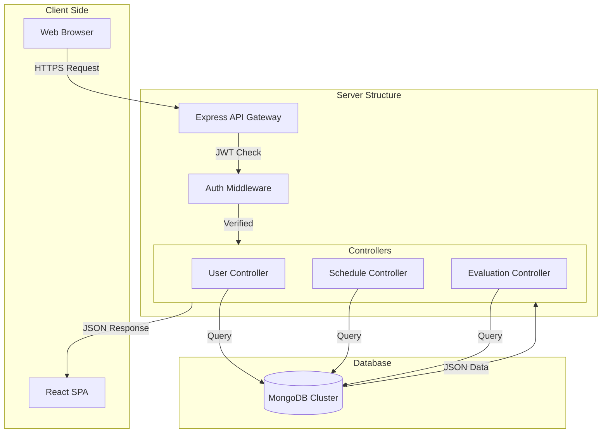

# System Architecture & Design Specification (SDS) Reference

## 1. Architectural Pattern
The FYP Management System follows the **MERN Stack** architecture, which is a variation of the classic **Client-Server** model. It specifically uses a **Three-Tier Architecture**:

1.  **Presentation Layer (Frontend)**: React.js application.
2.  **Application Layer (Backend)**: Node.js + Express.js server.
3.  **Data Layer (Database)**: MongoDB.

The backend implementation follows the **MVC (Model-View-Controller)** design pattern (minus the 'View' which is handled by the React frontend).

---

## 2. Technology Stack
*   **Frontend**:
    *   **Framework**: React (Vite build tool)
    *   **Styling**: Tailwind CSS (Utility-first framework)
    *   **State Management**: Context API (`AuthContext` for user session)
    *   **HTTP Client**: Axios
    *   **Icons**: Lucide React
*   **Backend**:
    *   **Runtime**: Node.js
    *   **Framework**: Express.js
    *   **Authentication**: JSON Web Tokens (JWT) + Bcrypt
    *   **ODM**: Mongoose (Object Data Modeling)
    *   **CORS**: Cross-Origin Resource Sharing handling
*   **Database**:
    *   **MongoDB**: NoSQL Document Database. Store data in JSON-like documents.

---

## 3. Detailed Component Breakdown (For SDS Diagram)

### A. Frontend Architecture
The frontend is built as a **Single Page Application (SPA)**.
*   **`App.jsx`**: The main entry point, handling routing and global layout.
*   **`AuthContext.jsx`**: A global provider that manages the user's login state and `role`. This is the core of the **RBAC (Role-Based Access Control)**.
*   **Components**: Modular UI blocks.
    *   `Sidebar.jsx`: Dynamic navigation based on user role.
    *   `Dashboard.jsx`: The main view switcher. It renders different interactions (e.g., `StudentDashboard`, `CoordinatorDashboard`) based on the logged-in user.
    *   `EvaluationForm.jsx`, `Schedules.jsx`: Specialized feature modules.

### B. Backend Architecture (MVC)
The server is structured to separate concerns:
1.  **Routes (`/routes`)**:
    *   Define the API endpoints (e.g., `POST /api/login`, `GET /api/schedules`).
    *   Map endpoints to specific Controller functions.
    *   Apply **Middleware** (e.g., `protect` checks if JWT is valid, `authorize` checks if user is Admin/Coordinator).
2.  **Controllers (`/controllers`)**:
    *   Contains the business logic.
    *   Example (`evaluatorController.js`): Receives request -> specific logic (calculate average score) -> calls Model -> returns JSON response.
3.  **Models (`/models`)**:
    *   Defines the Schema (structure) of the data.
    *   Example (`Evaluation.js`): Defines that an evaluation must have `studentId`, `marks`, `rubric`.

---

## 4. Key Relationships & Data Flow
When a user performs an action (e.g., **"Submit Evaluation"**):

1.  **Frontend**: `EvaluationForm.jsx` collects data.
2.  **Axios**: Sends a `POST` request to `http://.../api/evaluator/assignments/:id/evaluate`.
3.  **Middleware**: `authMiddleware.js` verifies the token ("Is this 'Aleem'? Is he an 'InternalEvaluator'?").
4.  **Route**: `evaluatorRoutes.js` passes control to `evaluatorController.js`.
5.  **Controller**:
    *   Checks if evaluation already exists (Business Logic).
    *   Creates a new `Evaluation` document using the `EvaluationModel`.
    *   Updates the `Schedule` to mark it as 'Completed'.
6.  **Database**: MongoDB stores the new document.
7.  **Response**: Server sends `201 OK` back to Frontend.
8.  **UI**: Frontend shows "Success" message and updates the dashboard.

---

## 5. Deployment / Component Diagram Structure
If you are drawing a visual SDS diagram, structure it like this:

## 6. Security Architecture
1.  **Authentication**: Users exchange credentials for a **JWT (access token)**. This token must be present in the Header (`Authorization: Bearer <token>`) for all subsequent requests.
2.  **Password Security**: Passwords are never stored as plain text. They are hashed using **Bcrypt** with salt.
3.  **Magic Links**: External evaluators access the system via signed tokens (JWTs) embedded in URL links, granting temporary, restricted access without full account creation.
