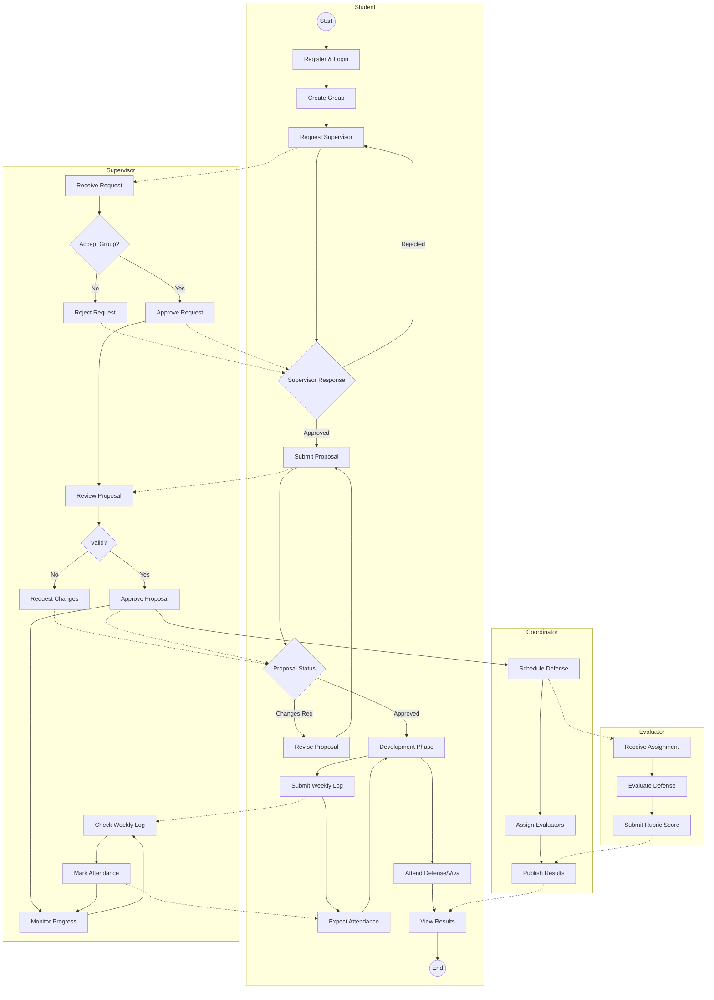

# FYP Management System - BPMN To-Be Model

This diagram represents the "To-Be" process flow for the FYP Management System, using Swimlanes to define the responsibilities of each actor.

## Process Descriptions

### 1. Initiation Phase
The process begins with the **Student** registering and forming a group. They send a request to a **Supervisor**. The Supervisor can accept or reject this request. If accepted, the group is formalized.

### 2. Proposal Phase
The group submits a project proposal. The **Supervisor** reviews it. If it meets standards, it is approved; otherwise, revisions are requested. Approval triggers the **Coordinator** to eventually schedule the Proposal Defense.

### 3. Execution & Monitoring Phase
This is a recurring loop. Students submit **Weekly Logs**. Supervisors review these logs to track progress and mark **Attendance**. This ensures continuous monitoring throughout the semester.

### 4. Evaluation Phase
The **Coordinator** creates schedules for various evaluations (Proposal, Mid-term, Final). **Evaluators** (Internal/External) are assigned to these schedules. They conduct the defense, grade usage a digital rubric, and submit scores. finally, the Coordinator publishes the results for the Students to view.
